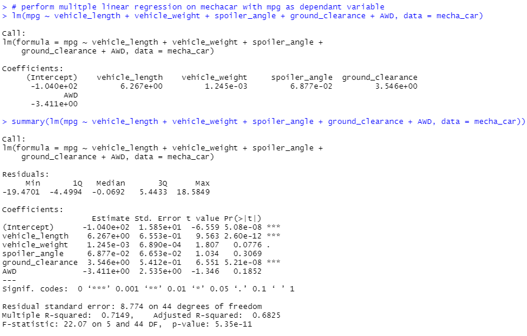

# MechaCar_Statistical_Analysis

## Resources
R 4.0.5, RStudio 1.4.1106, MechaCar.csv and SuspensionCoil.csv datasets

## Overview 

A car company has gathered data on multiple prototypes for a new model, the MechaCar.  The first set of data details the vehicle lenght, weight, spoiler angle, ground clearance, and fuel efficiency in miles per gallon for each prototype, as well as whether each prototype is all wheel drive or not.  The second data set details the weight capacity of the suspension coils accross different production lots for the prototypes.  Using this data, the car company has requested a series of statistical tests.

### Deliverable 1: Linear Regression to Predict MPG

The company has requested a linear regression model to predict the affect of the various attributes recorded in the first data set on fuel efficiency.  Using R, I developed a multiple linear regression model to predict how vehicle length, vehicle weight, spoiler angle, ground_clearance, and all wheel drive classification would affect fuel efficiency.  I then gathered the summary statistics of the linear regression model; the model itself and the summary are seen here:

;

#### Results
 - The summary shows that vehicle length and ground clearance both have a p-value well below the standard assumed significance level of .05.  Therefore I conclude that these factors provide a non-random and thus statistically significant variance in the resulting miles per gallon.  Additionally, the intercept also has a p-value below .05, indicating there are more factors not observed in this data set that may contribute significant variance to the miles per gallon

 - The summary shows that the r-squared value for the model is .6825, meaning that the model can predict miles per gallon accurately 68% of the time.  Combined with the significance of the variables listed above, there is sufficient evidence to reject the null hypothesis and determine that the slope of the model is not 0.

 - While the slope of the model is not 0 and the vehicle length and ground clearance demonstrate significance, the significance of the y intercept in the model indicates that more factors not included in the model are significant.  Although this model is fairly accurate at predicting fuel efficiency within the observed prototypes, the model will likely not predict future outcomes well.  More factors would need to be observed and added to the model to determine which missing variables are significant and thus build a model more capable of predicting fuel efficiency outcomes.

 ### Deliverable 2: Summary Statistics on Suspension Coils

 The company requested summary statistics on the weight capacity of the suspension coils produced accross different manufacturing lots.  Specifically, the company wished to determine if the the variance in PSI exceeds the maximum allowable variance of 100 according to the design specifications.

 A summary of all coils produced shows that the variance in PSI does not exceed 100:

 

 However, the summaries for each lot show that lots 1 and 2 do not exceed the maximum variance, while lot 3 does with a variance of 170.2:

 

 While the overall production does meat the desing specifications, coils from lot 3 do not, and should be removed from production until the issue causing such a large variance is determined and resolved.

 