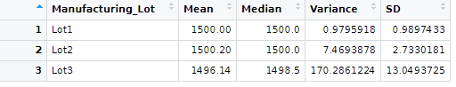

# MechaCar_Statistical_Analysis

## Resources
R 4.0.5, RStudio 1.4.1106, MechaCar.csv and SuspensionCoil.csv datasets

## Overview 

A car company has gathered data on multiple prototypes for a new model, the MechaCar.  The first set of data details the vehicle lenght, weight, spoiler angle, ground clearance, and fuel efficiency in miles per gallon for each prototype, as well as whether each prototype is all wheel drive or not.  The second data set details the weight capacity of the suspension coils accross different production lots for the prototypes.  Using this data, the car company has requested a series of statistical tests.

### Deliverable 1: Linear Regression to Predict MPG

The company has requested a linear regression model to predict the affect of the various attributes recorded in the first data set on fuel efficiency.  Using R, I developed a multiple linear regression model to predict how vehicle length, vehicle weight, spoiler angle, ground_clearance, and all wheel drive classification would affect fuel efficiency.  I then gathered the summary statistics of the linear regression model; the model itself and the summary are seen here:

;

#### Results
 - The summary shows that vehicle length and ground clearance both have a p-value well below the standard assumed significance level of .05.  Therefore I conclude that these factors provide a non-random and thus statistically significant variance in the resulting miles per gallon.  Additionally, the intercept also has a p-value below .05, indicating there are more factors not observed in this data set that may contribute significant variance to the miles per gallon

 - The summary shows that the r-squared value for the model is .6825, meaning that the model can predict miles per gallon accurately 68% of the time.  Combined with the significance of the variables listed above, there is sufficient evidence to reject the null hypothesis and determine that the slope of the model is not 0.

 - While the slope of the model is not 0 and the vehicle length and ground clearance demonstrate significance, the significance of the y intercept in the model indicates that more factors not included in the model are significant.  Although this model is fairly accurate at predicting fuel efficiency within the observed prototypes, the model will likely not predict future outcomes well.  More factors would need to be observed and added to the model to determine which missing variables are significant and thus build a model more capable of predicting fuel efficiency outcomes.

 ### Deliverable 2: Summary Statistics on Suspension Coils

 The company requested summary statistics on the weight capacity of the suspension coils produced accross different manufacturing lots.  Specifically, the company wished to determine if the the variance in Weight Capacity exceeds the maximum allowable variance of 100 according to the design specifications.

 A summary of all coils produced shows that the variance in PSI does not exceed 100:

 

 However, the summaries for each lot show that lots 1 and 2 do not exceed the maximum variance, while lot 3 does with a variance of 170.2:

 

 While the overall production does meat the desing specifications, coils from lot 3 do not, and should be removed from production until the issue causing such a large variance is determined and resolved.

 ### Deliverabe 3: T Tests on Suspension Coils

 The company wanted to know if there was any statistical difference between the all the coils produced and the population mean of 1500, as well as if there was any statistical difference between the individual lots and the population mean.

 I conducted a T-test on the entire group of suspension coils against the mean of 1500. 

 

 The p-value for all lots is .06, slightly higher than the common significance level of .05.  Thus there is not sufficient evidence to reject the null hypothesis, and therefore we can assume that the group of all lots is statistically similar to the population mean.

 For Lot 1, the p-value is 1:

 

 This is much higher than the significance level of .05, and thus again there is not sufficient evidence to reject the null hypothesis, so Lot 1 and the population mean are statistically similar.

 For Lot 2, the p-value is .607:

 

Again, this is higher than the significance level of .05.  So for Lot 2 we cannot reject the null hypothesis, and we conclude Lot 2 and the mean are statistically similar.

For Lot 3, the p-value is .04:

For this lot, the p-value is below the standard significance level of .05.  Thus we have sufficient evedince to reject the null hypothesis and conclude that Lot 3 and the mean are statistically different.  

### Deliverable 4: Study Design: MechaCar vs Competition

The company wants an option for a statistical test to be performed to compare a key metric of their MechaCar to cars from other manufacturers.  I propose to perform and ANOVA test to determine if there is any statistical difference between MechaCar's mean fuel efficiency and the mean fuel efficiency of other manufacturers.  The ANOVA test determines if there is any statistical difference between the mean of a given metric across more than two sample populations.  Being able to compare accross multiple populations makes the ANOVA test more ideal than a T-test, as a test can only compare one sample population to either another sample population or the population mean.  To compare MechaCar to multiple other manufacturers, a separate T-test would be needed to compare MechaCar to each manufacturer.  An ANOVA test allows several manufacturers to be compared in one test.

In this test, the null hypothesis is that there is no statisctical difference between the fuel efficiency of cars from various manufacturers.  The alternative hypothesis is that there is a statistical difference between the mean fuel efficiency of one of the manufacturers and the others.

MechaCar's fuel efficiency data has already been collected, so data on fuel efficiency for other manufacturers needs to be collected to perform the test.  To ensure an accurate test, the conditions under which the MechaCar's fuel efficiency data were collected should be recreated in collecting data for the other cars, ie they should be observed on similar terrain, weather, and weight of cargo and passengers in the vehicles.  If the MechaCar was tested in city conditions, other cars should be as well.  Alternatively if the MechaCar was tested on highway, the other cars should be as well.

The test should be limited to 4 other manufacturers along side the MechaCar.
